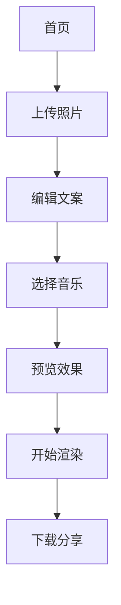

## 1. Product Overview
中式婚礼视频生成器，用于创建30秒红金配色的婚礼祝福视频。解决新人需要专业婚礼视频的需求，通过Remotion技术让任何人都能快速生成高质量中式婚礼视频。

## 2. Core Features

### 2.1 User Roles
| Role | Registration Method | Core Permissions |
|------|---------------------|------------------|
| 普通用户 | 邮箱注册 | 上传照片、选择模板、生成视频 |
| 高级用户 | 付费升级 | 自定义文案、高清导出、批量生成 |

### 2.2 Feature Module
中式婚礼视频生成器包含以下核心页面：
1. **首页**: 模板展示、上传照片入口、快速开始
2. **编辑页**: 照片管理、文案编辑、音乐选择、实时预览
3. **生成页**: 视频渲染进度、下载分享

### 2.3 Page Details
| Page Name | Module Name | Feature description |
|-----------|-------------|---------------------|
| 首页 | 模板展示 | 展示红金配色中式模板，支持预览效果 |
| 首页 | 上传入口 | 拖拽上传新人照片，自动检测人脸位置 |
| 编辑页 | 照片管理 | 添加/删除照片，调整显示顺序和时长 |
| 编辑页 | 文案编辑 | 四段文案输入框，提供默认中式祝福语 |
| 编辑页 | 音乐选择 | 内置传统婚礼音乐库，支持音量调节 |
| 编辑页 | 实时预览 | 低分辨率快速预览，支持暂停和重播 |
| 生成页 | 渲染进度 | 显示渲染百分比，预估剩余时间 |
| 生成页 | 下载分享 | 生成1080P视频，支持一键分享到微信 |

## 3. Core Process
用户操作流程：
1. 用户访问首页，选择中式婚礼模板
2. 上传4-8张新人照片，系统自动优化构图
3. 编辑四段文案（开场、相识、相爱、祝福）
4. 选择背景音乐，调整音量和过渡效果
5. 预览低分辨率版本，确认无误后开始渲染
6. 等待30-60秒完成高清渲染
7. 下载视频或分享到社交媒体

## 4. User Interface Design

### 4.1 Design Style
- 主色调：中国红 (#DC143C) + 金色 (#FFD700)
- 按钮样式：圆角矩形，悬停有金色光晕效果
- 字体：思源黑体 + 楷体用于祝福语
- 布局：卡片式布局，居中对称设计
- 图标：使用传统纹样（回纹、云纹）作为装饰元素

### 4.2 Page Design Overview
| Page Name | Module Name | UI Elements |
|-----------|-------------|-------------|
| 首页 | 模板展示 | 全屏轮播展示模板效果，红色渐变背景，金色标题文字 |
| 编辑页 | 照片管理 | 网格布局显示照片缩略图，支持拖拽排序，金色边框选中状态 |
| 编辑页 | 文案编辑 | 竖排文字输入框，仿古卷轴背景，实时字数统计 |
| 生成页 | 渲染进度 | 圆形进度条，金色填充，红色背景，显示预计时间 |

### 4.3 Responsiveness
桌面端优先设计，移动端自适应。编辑页在平板模式下采用左右分栏布局。

### 4.4 3D Scene Guidance
- 环境：传统中式庭院，红色灯笼高挂，金色阳光透过
- 光照：暖色调主光，模拟午后阳光，强度0.8，启用柔和阴影
- 相机：固定视角，轻微推拉镜头营造层次感
- 构图：前景为红色绸缎，中景为照片展示区域，背景为传统建筑
- 动画：照片切换采用翻页效果，文案出现使用毛笔书写动画
- 后处理：轻微辉光效果，色彩饱和度+20%，暖色色温调整