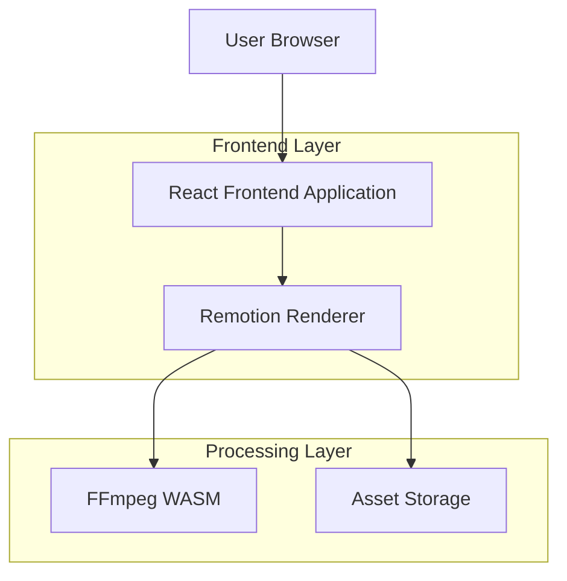

## 1. Architecture design



## 2. Technology Description
- Frontend: React@18 + TypeScript + Vite
- Initialization Tool: vite-init
- Video Engine: Remotion@4 + FFmpeg WASM
- Backend: None (纯前端渲染)
- 状态管理: Zustand
- UI组件: Ant Design + 自定义中式组件

## 3. Route definitions
| Route | Purpose |
|-------|---------|
| / | 首页，模板选择和上传入口 |
| /editor | 编辑页面，照片和文案编辑 |
| /preview | 预览页面，低分辨率预览 |
| /render | 渲染页面，高清视频生成 |
| /download | 下载页面，视频下载和分享 |

## 4. API definitions
### 4.1 素材管理
```
GET /api/assets/templates
```

Response:
```json
{
  "templates": [
    {
      "id": "chinese_traditional",
      "name": "中式传统",
      "preview": "/assets/previews/chinese.jpg",
      "colors": {
        "primary": "#DC143C",
        "secondary": "#FFD700"
      }
    }
  ]
}
```

### 4.2 音乐资源
```
GET /api/assets/music
```

Response:
```json
{
  "tracks": [
    {
      "id": "wedding_traditional",
      "name": "中式婚礼音乐",
      "duration": 30,
      "url": "/assets/music/traditional.mp3"
    }
  ]
}
```

## 5. Server architecture diagram
不适用，本项目采用纯前端架构，所有渲染在浏览器端完成。

## 6. Data model
不适用，无持久化数据存储需求。用户上传的照片和配置仅在会话期间保存在内存中。